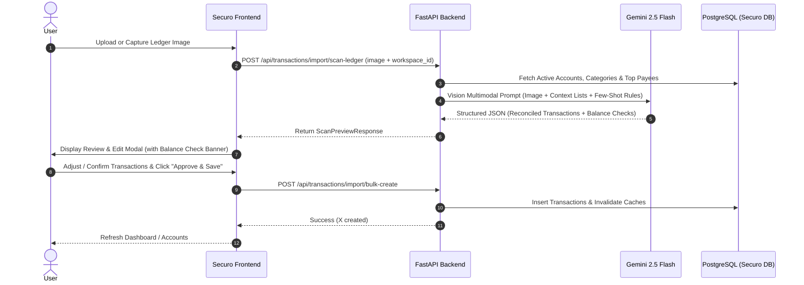

# Feature Specification: Handwritten Ledger Scan & Transaction Review

## 1. Overview & Objective
This specification defines the design and implementation for an **AI-powered Handwritten Ledger Scanner** in Securo. 

Users write their daily cash flows and expenses into a physical double-entry ledger (*Roznamcha*). The feature enables users to upload or capture a photo of their daily ledger page, automatically parses all transactions using a multimodal Vision LLM (Gemini 2.5 Flash), opens an interactive **Review & Edit Popup**, and saves approved transactions directly into Securo with correct accounts, categories, payees, and metadata tags.

---

## 2. Analysis of the User's Ledger Bookkeeping System

### 2.1 Visual Structure & Layout
Each page represents a single calendar day (e.g. `27/7/26` $\rightarrow$ `2026-07-27`):

```text
+-----------------------------------+-----------------------------------+
| DATE: DD/MM/YY                    |                                   |
| (Left Column: Inflows / Receipts) | (Right Column: Outflows / Exp.)   |
+-----------------------------------+-----------------------------------+
| [Amount] B/F [Breakdown...]       | [Amount] Bank Contra / Transfers  |
| [Amount] Direct Bank Receipts     | [Amount] Direct Expenses          |
| [Amount] Sales (Cash + Bank splits| [Amount] Delivery / Misc splits   |
+-----------------------------------+-----------------------------------+
| [Total Inflows + B/F]             | [Subtotal Expenses]               |
|                                   | [Amount] C/F [Cash Breakdown...]  |
+-----------------------------------+-----------------------------------+
| TOTAL LEFT (e.g. 45,185)          | TOTAL RIGHT (e.g. 45,185)         |
+-----------------------------------+-----------------------------------+
```

### 2.2 Arithmetic Reconciliation Integrity
The ledger contains a built-in mathematical check:
- **Left Column**: $\text{B/F (Opening Cash)} + \sum \text{Receipts} = \text{Total Left}$
- **Right Column**: $\sum \text{Outflows/Transfers} + \text{C/F (Closing Cash)} = \text{Total Right}$
- **Integrity Rule**: $\text{Total Left} == \text{Total Right}$
- When parsing, the AI extracts both $\text{Total Left}$ and $\text{Total Right}$ to verify recognition accuracy.

---

## 3. Real-World Case Studies (July 27 & 28, 2026)

### Case 1: 27 July 2026 (`27/7/26`)
- **Left Column**:
  - `30735 | B/F 19800 + 10935`: Opening cash balance (₹19,800 + ₹10,935).
  - `3398 | DR ANK DAV PNB ch. 739162`: Cheque receipt from `Dr.ANK DAV` deposited to SBI CC account.
  - `4998 | Sale cash-300 + HUF-4698`: Sales split into ₹300 cash and ₹4,698 HUF bank transfer.
  - *Left Total: ₹39,131*
- **Right Column**:
  - `3398 | SBIRIE tr frm DR ANK`: Contra entry for cheque deposit.
  - `4698 | SK HUF tr frm sale`: Contra entry for HUF bank credit.
  - `31035 | C/F 19800 + 11235`: Closing cash (30,735 opening + 300 cash sale = 31,035).
  - *Right Total: ₹39,131*

**Securo Mapping Results:**
1. `₹3,398.00` | **Credit** | Payee: `Dr.ANK DAV` | Category: `Sales` | Account: `SBI - CC - GPW Offset` | Notes: `Spent by: Factory | Mode: Bank Transfer`
2. `₹4,698.00` | **Credit** | Payee: — | Category: `Sales` | Account: `SBI - Ganesh Kejariwal HUF` | Notes: `Spent by: Factory | Mode: Bank Transfer`
3. `₹300.00` | **Credit** | Payee: — | Category: `Sales` | Account: `Cash - Wallet` | Notes: `Spent by: Factory | Mode: Cash`

---

### Case 2: 28 July 2026 (`28/7/26`)
- **Left Column**:
  - `31035 | B/F : 19800 + 11235`: Opening cash from 27/7.
  - `1350 | Sale - HUF - 1350`: Direct HUF bank sale credit.
  - `12500 | cash MSM 12500`: Cash sale from payee `MSM Maa Shopping Mall`.
  - `300 | Ayush Federal tr to Notrying`: Transfer from Ayush Federal account to cover notary fees.
  - *Left Total: ₹45,185*
- **Right Column**:
  - `1350 | SK HUF tr frm sale`: Contra reference.
  - `2000 | House Exp. AC fitting Godrej`: AC installation cash expense.
  - `580 | Rent - Otc Agreement - Exp.`: Rent agreement cash expense.
  - `300 | House Exp. Notary charge 300.`: Notary paid from `Federal - Ayush Kejariwal`.
  - `1350 | Delivy Exp. Ajay Auto 400 . Alauddin 950.`: Delivery cash expense with sub-vendor details.
  - `400 | Baleno . Puncture`: Vehicle repair cash expense.
  - `39205 | C/F 19800 + 12500 + 6905`: Closing cash carried forward.
  - *Right Total: ₹45,185*

**Securo Mapping Results:**
1. `₹1,350.00` | **Credit** | Category: `Sales` | Account: `SBI - Ganesh Kejariwal HUF` | Notes: `Spent by: Factory | Mode: Bank Transfer`
2. `₹12,500.00` | **Credit** | Payee: `MSM Maa Shopping Mall` | Category: `Sales` | Account: `Cash - Wallet` | Notes: `Spent by: Factory | Mode: Cash`
3. `₹2,000.00` | **Debit** | Category: `House` | Description: `House` | Account: `Cash - Wallet` | Notes: `AC Installation`
4. `₹580.00` | **Debit** | Category: `House` | Description: `House` | Account: `Cash - Wallet` | Notes: `rent agreement | Spent by: Home | Mode: Cash`
5. `₹300.00` | **Debit** | Category: `House` | Description: `House` | Account: `Federal - Ayush Kejariwal` | Notes: `notary | Spent by: Home | Mode: Bank Transfer`
6. `₹1,350.00` | **Debit** | Category: `Transport` | Description: `Transport` | Account: `Cash - Wallet` | Notes: `alauddin950 ajay auto400 | Spent by: Factory | Mode: Cash`
7. `₹400.00` | **Debit** | Category: `Baleno` | Description: `Baleno` | Account: `Cash - Wallet` | Notes: `Spent by: Vehicle | Mode: Cash`

---

## 4. Architecture & Implementation Plan



---

## 5. Vision AI Prompt Design

The system will inject the workspace's actual accounts, categories, and payees dynamically into the prompt.

### 5.1 System Prompt Template
```markdown
You are an expert accounting vision assistant specializing in parsing handwritten Indian daily cash books (Roznamcha).
You will be provided with an image of a daily ledger page. Your task is to extract all discrete financial transactions while ignoring balance carry-forwards (B/F and C/F) and pure contra transfer lines.

### WORKSPACE CONTEXT:
ACCOUNTS AVAILABLE:
{{accounts_json}}

CATEGORIES AVAILABLE:
{{categories_json}}

KNOWN PAYEES:
{{payees_json}}

### PARSING RULES:
1. DATE:
   - Identify the date header (e.g., "27/7/26" = 2026-07-27, "28/7/26" = 2026-07-28).

2. BALANCING & TOTALS:
   - Extract "B/F" (Brought Forward balance) and "C/F" (Carried Forward balance).
   - Extract "Left Total" and "Right Total".
   - Verify if Left Total equals Right Total.

3. INFLOWS (LEFT COLUMN) -> CREDIT TRANSACTIONS:
   - "DR ANK DAV PNB ch. 739162" -> Payee: Dr.ANK DAV, Category: Sales, Account: SBI CC / GPW, Notes: "PNB ch. 739162 | Spent by: Factory | Mode: Bank Transfer"
   - "Sale cash-300 + HUF-4698" -> Split into TWO transactions:
     * Trans 1: Amount 300, Account: Cash - Wallet, Category: Sales, Notes: "Spent by: Factory | Mode: Cash"
     * Trans 2: Amount 4698, Account: SBI - Ganesh Kejariwal HUF, Category: Sales, Notes: "Spent by: Factory | Mode: Bank Transfer"
   - "cash MSM 12500" -> Amount: 12500, Payee: MSM Maa Shopping Mall, Account: Cash - Wallet, Category: Sales, Notes: "Spent by: Factory | Mode: Cash"
   - Inter-account funding lines like "Ayush Federal tr to Notrying 300" fund the corresponding expense on the right column.

4. OUTFLOWS (RIGHT COLUMN) -> DEBIT TRANSACTIONS:
   - Lines with "tr frm" (like "SBIRIE tr frm DR ANK" or "SK HUF tr frm sale") are contra/internal transfer records of left-side receipts. DO NOT create duplicate debits for these.
   - "House Exp. AC fitting Godrej 2000" -> Category: House, Account: Cash - Wallet, Description: "House", Notes: "AC Installation"
   - "Rent-Otc Agreement-Exp. 580" -> Category: House, Description: "House", Account: Cash - Wallet, Notes: "rent agreement | Spent by: Home | Mode: Cash"
   - "House Exp. Notary charge 300" -> Category: House, Description: "House", Account: Federal - Ayush Kejariwal (funded via Federal tr), Notes: "notary | Spent by: Home | Mode: Bank Transfer"
   - "Delivy Exp. Ajay Auto 400 . Alauddin 950. 1350" -> Amount: 1350, Category: Transport, Description: "Transport", Account: Cash - Wallet, Notes: "alauddin950 ajay auto400 | Spent by: Factory | Mode: Cash"
   - "Baleno . Puncture 400" -> Amount: 400, Category: Baleno, Description: "Baleno", Account: Cash - Wallet, Notes: "Spent by: Vehicle | Mode: Cash"

5. METADATA TAG CONVENTIONS:
   - Format notes consistently: "[details] | Spent by: [Factory|Home|Vehicle] | Mode: [Cash|Bank Transfer]"
```

---

## 6. API & Data Schemas

### 6.1 Backend Endpoints
- `POST /api/transactions/import/scan-ledger`
  - Input: `file: UploadFile` (Multipart)
  - Output: `LedgerScanPreview` schema
- `POST /api/transactions/import/bulk-save`
  - Input: List of validated transaction objects
  - Output: Count of created transactions and IDs

### 6.2 Pydantic Schemas (`app/schemas/ledger_scan.py`)
```python
class LedgerScanItem(BaseModel):
    date: date
    type: Literal["debit", "credit"]
    amount: Decimal
    description: str
    category_id: Optional[UUID] = None
    account_id: Optional[UUID] = None
    payee_id: Optional[UUID] = None
    notes: Optional[str] = None
    raw_text: str
    confidence: float

class LedgerScanPreview(BaseModel):
    page_date: date
    opening_balance_bf: Optional[Decimal] = None
    closing_balance_cf: Optional[Decimal] = None
    left_total: Optional[Decimal] = None
    right_total: Optional[Decimal] = None
    is_balanced: bool
    transactions: list[LedgerScanItem]
    warnings: list[str] = []
```

---

## 7. Frontend UI / UX Specification

### 7.1 Entry Points
1. **Import Page (`pages/import.tsx`)**:
   - Add a tab or prominent card: **"Scan Handwritten Ledger"**.
   - Drag-and-drop zone + file browser + "Take Photo" (mobile camera trigger).
2. **Transactions Page (`pages/transactions.tsx`)**:
   - Add **"Scan Ledger"** button alongside "+ Add Transaction".

### 7.2 The Review & Edit Modal (`components/ledger-review-modal.tsx`)
- **Header**:
  - Extracted Ledger Date (editable datepicker).
  - Balance indicator banner:
    - `Green`: `✓ Ledger Balances: ₹45,185 (Receipts) == ₹45,185 (Payments)`
    - `Amber`: `⚠️ Ledger Mismatch: Left ₹45,185 ≠ Right ₹45,100 (Difference: ₹85)`
- **Interactive Review Table**:
  - Columns:
    1. **Include** (Checkbox)
    2. **Type** (Credit / Debit badge toggle)
    3. **Amount** (Editable number input)
    4. **Account** (Dropdown of workspace accounts, preselected by AI)
    5. **Category** (Dropdown of categories, preselected by AI)
    6. **Payee** (Searchable payee select / create new)
    7. **Description** (Editable text)
    8. **Notes / Tags** (Editable notes including `Spent by` and `Mode`)
    9. **Original Text** (Tooltip showing what handwritten line produced this)
- **Footer**:
  - Summary: `X transactions ready to import (Y Credits, Z Debits)`
  - Buttons: `Cancel`, `+ Add Row`, `Approve & Save (X)`

---

## 8. Clarification Questions for the User (Refining Prompts & Rules)

To make the AI extraction prompt 100% accurate, please review and answer these questions:

### Q1: Bank & Account Abbreviations
Besides what we saw on July 27-28, what other shorthand codes do you use?
- `SBIRIE` $\rightarrow$ `SBI - CC - GPW Offset`
- `SK HUF` / `HUF` $\rightarrow$ `SBI - Ganesh Kejariwal HUF`
- `Ayush Federal` $\rightarrow$ `Federal - Ayush Kejariwal`
- What do you write for:
  - `Union - Ganesh Kejariwal`?
  - `HDFC - Ganesh Kejariwal Jnt` / `HDFC - GPW Offset`?
  - `SBI - Ganesh Kejariwal` / `SBI - Madhu Kejriwal` / `BOB - Madhu Kejriwal`?
  - `IDFC - Ayush Kejariwal`?
  - Personal wallets (`Madhu Wallet`, `Ayush Wallet`, `Tanush Wallet`, `Ganesh Wallet`)?

### Q2: "Spent by" Tagging Rules
In the notes, we saw:
- `Spent by: Factory`
- `Spent by: Home`
- `Spent by: Vehicle`
Are there specific triggers for these? For example:
- Are all `Baleno` and `Destini` expenses automatically `Spent by: Vehicle`?
- Are `House Exp.` and personal groceries automatically `Spent by: Home`?
- Are sales, transport, delivery, and factory purchases automatically `Spent by: Factory`?
- Are there any other entities (e.g. `Spent by: Office`, `Spent by: Tanush`)?

### Q3: Internal Transfers vs Direct Funding
On 28 July: `Ayush Federal tr to Notrying 300` on the left was used to pay `House Exp. Notary charge 300` on the right.
In Securo, this was recorded as:
- Expense: ₹300 directly with `Account: Federal - Ayush Kejariwal`.
Is that always how you want it recorded (i.e. charge directly to the funding bank account, rather than a 2-step transfer into Cash Wallet and then Cash expense)?

### Q4: Multi-Day Sheets & Pagination
- Does each page in your notebook always contain exactly **one day**?
- Do you ever have a day that spills over into **two pages**?
- Do you ever write multiple days on a single page?
